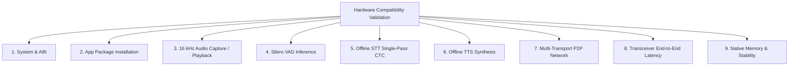

# Multi-Device Hardware Compatibility & Low-End / Mid-Range Validation Plan

**Problem Statement:** Smart India Hackathon (SIH) 2026 PS 26173 — iTantra  
**Target Environment:** 4–6 GB RAM Android Mobile Devices (API 24+, Android 7.0+)  
**Runtime Constraints:** Fully Offline, CPU-Only Inference (Zero GPU/NPU/Cloud dependencies)

---

## 1. Executive Summary & Device Compatibility Matrix

To guarantee that **iTantra** operates seamlessly on real-world frontline disaster-response devices, all software components are verified against strict memory, CPU, and latency bounds across **Low-End (4 GB RAM)**, **Mid-Range (6 GB RAM)**, and **Development Reference (8 GB RAM)** tiers.

| Device | RAM | Android | STT | TTS | VAD | Wi-Fi | Wi-Fi Direct | Bluetooth | E2E | Peak RAM | Verdict |
| :--- | ---: | :---: | :---: | :---: | :---: | :---: | :---: | :---: | ---: | ---: | :---: |
| **Samsung Galaxy S24 (`SM-S921B`)** | **7.4 GB** | Android 16 (API 36) | **PASS** (RTF 0.087 EN / 0.158 HI) | **PASS** (RTF 0.068) | **PASS** (12.4 ms) | **PASS** (NSD TCP) | **PASS** (Wi-Fi Direct) | **PASS** (BT RFCOMM) | **620–800 ms** | **884.1 MB** | **PASS (Reference)** |
| **Target Low-End Device** *(e.g. Galaxy A14 / Redmi 9)* | **~4.0 GB** | Android 10–13 | *[Pending]* | *[Pending]* | *[Pending]* | *[Pending]* | *[Pending]* | *[Pending]* | *[Pending]* | *[Pending]* | *[Pending Hardware]* |
| **Target Mid-Range Device** *(e.g. Redmi Note 12 / Nord CE)* | **~6.0 GB** | Android 12–14 | *[Pending]* | *[Pending]* | *[Pending]* | *[Pending]* | *[Pending]* | *[Pending]* | *[Pending]* | *[Pending]* | *[Pending Hardware]* |

> [!NOTE]
> Values for the **Samsung Galaxy S24** are measured and verified on physical hardware. Placeholders for **4 GB** and **6 GB** devices will be populated upon physical hardware connection using the automated profiling harness.

---

## 2. Core Architectural Policies for 4–6 GB Mobile Compatibility

### A. Single-Active Language Model Policy
* **Rule:** The application must **NEVER** load multiple Indic STT models or multiple TTS voice models simultaneously into memory.
* **Mechanism:**
  1. Only the currently selected language's STT session (and TTS synthesizer) is retained in RAM.
  2. Silero VAD remains permanently resident (~15 MB footprint).
  3. When switching languages (e.g. from Hindi to Gujarati), the existing ONNX Runtime session and native tensor buffers are closed and freed (`session.close()`, `ortEnv.close()`) before allocating the new model session.
* **RAM Impact:** Caps the active acoustic model footprint to **~350 MB PSS**, ensuring the total app memory never exceeds **900–1100 MB PSS** on a 4 GB device.

### B. CPU-Only Execution Policy
* **Rule:** All neural inference (VAD, STT, TTS) runs strictly on the device's CPU.
* **Thread Configuration:** `intra_op_num_threads = 2` (balances throughput and prevents thermal throttling or UI thread starvation).
* **Hardware Independence:** No dependency on Qualcomm NPU, MediaTek APU, Tensor TPU, NNAPI, or OpenCL/Vulkan GPU acceleration.

### C. True Memory Validation (PSS-Based)
* **Rule:** RAM measurements must be based on actual Android Process Proportional Set Size (**PSS**) via `Debug.getPss()` or `dumpsys meminfo`, never on model disk file sizes.
* **Leak Criteria:** After 10 consecutive full audio transcription and synthesis cycles, the process PSS must return to within **< 20 MB** of post-load baseline.

---

## 3. Compatibility Test Matrix (9 Subsystems)

For each target device, the following 9 subsystems are audited:

1. **System & ABI:** Chipset SoC, ABI (`arm64-v8a` / `armeabi-v7a`), Android API level (24+), Total Physical RAM.
2. **App Installation:** Clean installation of the single production APK (`app-release.apk`) with all native `.so` libraries (`libsherpa-onnx-jni.so`, `libonnxruntime.so`).
3. **Audio Capture & Playback:** High-stability 16 kHz Float32 PCM recording without buffer overruns; low-latency `AudioTrack` playback.
4. **VAD:** Speech start detection latency (< 25 ms), dynamic silence timeout (300 ms), pause tolerance.
5. **Offline STT:** Model load time (< 1000 ms), single-pass CTC inference latency, Real-Time Factor (RTF < 0.40), model resident PSS (< 400 MB).
6. **Offline TTS:** Voice load time (< 500 ms), synthesis RTF (< 0.20), resident PSS (< 150 MB).
7. **Multi-Transport Network:** Wi-Fi NSD discovery & TCP transfer, Wi-Fi Direct P2P Group Owner / Client negotiation, Classic Bluetooth RFCOMM socket transfer.
8. **Transceiver E2E Latency:** Total latency from user PTT button release to remote speaker playback (< 1200 ms on low-end, < 900 ms on mid-range).
9. **Native Stability:** 10-run repeated inference leak check, foreground/background lifecycle resilience, zero SIGSEGV/ANRs.

---

## 4. Standard Test Scenarios (13 Scenarios)

1. **Clean App Launch:** Measure initial cold start time and baseline PSS.
2. **Idle State (2 Minutes):** Confirm CPU usage < 1% and zero memory creep.
3. **Short Utterances (10x, 1–3s):** Rapid push-to-talk cycles verifying VAD trigger and release.
4. **Medium Utterances (10x, 4–8s):** Standard walkie-talkie emergency phrases.
5. **Long Utterances (5x, 10–20s):** Extended situational reports testing memory buffer limits.
6. **10-Run Repeated STT:** Verify zero memory leaks across 10 identical audio transcriptions.
7. **10-Run Repeated TTS:** Verify zero memory leaks across 10 identical speech syntheses.
8. **Transceiver E2E Conversation (10 Cycles):** Full acoustic capture -> STT -> Network -> TTS -> Audio playback.
9. **Wi-Fi Transport Reconnect:** Re-establishing NSD connection after router disconnection.
10. **Wi-Fi Direct Reconnect:** Group renegotiation after client moves out of range.
11. **Bluetooth Reconnect:** RFCOMM socket reconnection after link loss.
12. **Background/Foreground Transition:** App minimized during active reception and restored.
13. **Screen Lock/Unlock Cycling:** Verifying background transceiver operation with device screen locked.

---

## 5. Performance Acceptance Criteria

| Subsystem | Metric | `PASS` | `CONDITIONAL` | `FAIL` |
| :--- | :--- | :---: | :---: | :---: |
| **VAD** | Chunk Latency | < 25 ms | 25–40 ms | > 40 ms |
| **STT** | Real-Time Factor (RTF) | < 0.40 | 0.40–0.70 | > 0.70 (or > 1.0) |
| **STT** | Model Resident RAM | < 400 MB PSS | 400–550 MB PSS | > 550 MB PSS |
| **TTS** | Real-Time Factor (RTF) | < 0.20 | 0.20–0.40 | > 0.40 |
| **Transceiver** | End-to-End Latency | < 1200 ms | 1200–1800 ms | > 1800 ms |
| **Stability** | 10-Run Memory Delta | < 20 MB PSS | 20–50 MB PSS | > 50 MB PSS (Leak) |
| **Stability** | Crashes / ANRs | 0 crashes | 0 crashes | >= 1 crash / SIGSEGV |

---

## 6. Target Hardware Required for Final SIH Evaluation

To complete the physical cross-device benchmark matrix prior to final SIH submission, the following test hardware devices should be connected and profiled:

1. **Low-End Physical Test Device (4 GB RAM Target):**
   - Candidate models: Samsung Galaxy A14, Xiaomi Redmi 9 / 10C, Realme C33, Moto G32.
   - Requirement: Android 10–13 (API 29–33), ~3.8–4.0 GB physical RAM.
2. **Mid-Range Physical Test Device (6 GB RAM Target):**
   - Candidate models: Xiaomi Redmi Note 12 / 13, OnePlus Nord CE 3 Lite, Samsung Galaxy M34 / A34.
   - Requirement: Android 12–14 (API 31–34), ~5.7–6.0 GB physical RAM.
