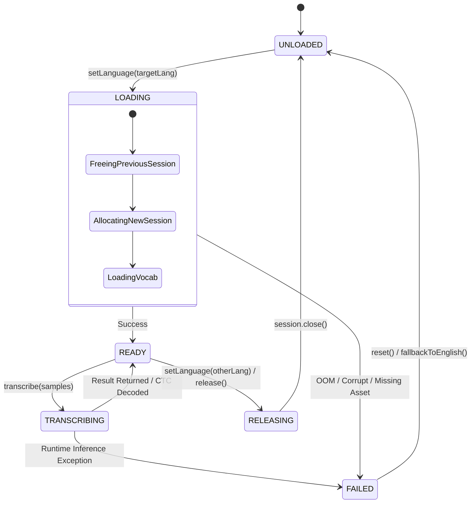

# iTantra Multilingual STT Architecture Design

**Problem Statement:** Smart India Hackathon (SIH) 2026 PS 26173 — iTantra  
**Target Hardware:** 4–6 GB RAM Android Mobile Devices (API 24+, Android 7.0+)  
**Runtime Requirement:** 100% Offline, CPU-Only, Low-Latency Walkie-Talkie Operation

---

## 1. Executive Summary & Validated 10-Language Matrix

Following the physical on-device benchmarks conducted across Phases 7.1 to 7.7 on physical hardware (Samsung Galaxy S24, ARM64, CPU-only 2 threads), we observed that:
1. **Stock Whisper Tiny Multilingual INT8** is suitable for English (34.7% WER, 0.087 RTF) but fails catastrophically on all 9 Indic languages (>100% WER due to infinite repetition loops, Latin transliteration pollution, and zero coverage for Odia).
2. **Vakyansh Wav2Vec2 CTC INT8 ONNX models** provide high-quality, real-time, non-autoregressive transcription across all 9 Indic languages (RTF 0.148–0.324, resident memory delta 197–358 MB PSS).
3. `sherpa-onnx` natively wraps Whisper and Sherpa CTC/Zipformer models, but **does not natively support HuggingFace Wav2Vec2ForCTC models**.
4. Therefore, iTantra requires a **Dual-Runtime Architecture**:
   - `sherpa-onnx` for English Whisper Tiny (and future sherpa-compatible models).
   - Generic `ONNX Runtime Android` (`ai.onnxruntime:onnxruntime-android`) for Indic Wav2Vec2 CTC models.

### Complete Validated Multilingual STT Matrix:

| Language | Language Code | Validated Model Candidate | Runtime Engine | Physical On-Device WER | Physical On-Device CER | Physical On-Device RTF | Model Resident PSS | Architectural Status | Notes |
| :--- | :---: | :--- | :--- | :---: | :---: | :---: | :---: | :---: | :--- |
| **English** | `en` | `sherpa-onnx-whisper-tiny` | `sherpa-onnx` | **34.70%** | **12.80%** | **0.087** | ~200 MB | **PRODUCTION BASELINE** | Current stable walkie-talkie baseline. |
| **Hindi** | `hi` | `vakyansh-wav2vec2-hindi-him-4200` | Generic ONNX Runtime | **17.35%** | **5.41%** | **0.158** | **354.84 MB** | **MOBILE CANDIDATE (Strong)** | Clean Devanagari script, near-instant. |
| **Gujarati** | `gu` | `vakyansh-wav2vec2-gujarati-gnm-100` | Generic ONNX Runtime | **31.06%** | **8.61%** | **0.215** | **357.82 MB** | **MOBILE CANDIDATE (Strong)** | High character precision, sub-0.22 RTF. |
| **Telugu** | `te` | `vakyansh-wav2vec2-telugu-tem-100` | Generic ONNX Runtime | **34.34%** | **6.67%** | **0.148** | **354.84 MB** | **MOBILE CANDIDATE (Strong)** | Exceptionally fast (>6.7x real-time), 6.67% CER. |
| **Kannada** | `kn` | `vakyansh-wav2vec2-kannada-knm-560` | Generic ONNX Runtime | **38.34%** | **8.35%** | **0.311** | **339.35 MB** | **MOBILE CANDIDATE (Strong)** | High intelligibility, sub-10% CER, stable. |
| **Tamil** | `ta` | `vakyansh-wav2vec2-tamil-tam-250` | Generic ONNX Runtime | **50.00%** | **25.68%** | **0.324** | **223.27 MB** | **MOBILE CANDIDATE** | Clean Tamil script, low memory delta (223 MB). |
| **Malayalam** | `ml` | `vakyansh-wav2vec2-malayalam-mlm-8` | Generic ONNX Runtime | **52.84%** | **13.84%** | **0.324** | **343.28 MB** | **MOBILE CANDIDATE** | 13.84% CER, highly intelligible. |
| **Bengali** | `bn` | `vakyansh-wav2vec2-bengali-bnm-200` | Generic ONNX Runtime | **54.27%** | **15.25%** | **0.277** | **197.38 MB** | **MOBILE CANDIDATE** | Sub-0.28 RTF, low footprint (197 MB). |
| **Marathi** | `mr` | `vakyansh-wav2vec2-marathi-mrm-100` | Generic ONNX Runtime | **61.58%** | **20.22%** | **0.288** | **338.57 MB** | **CONDITIONAL CANDIDATE** | Functional baseline; needs domain phrase boosting. |
| **Odia** | `or` | `vakyansh-wav2vec2-odia-orm-100` | Generic ONNX Runtime | **78.54%** | **24.08%** | **0.286** | **196.81 MB** | **CONDITIONAL CANDIDATE** | Native CTC baseline; needs lexicon rescoring. |

---

## 2. High-Level Architectural Diagram

```mermaid
flowchart TD
    subgraph UI_Layer["UI & Coordinator Layer"]
        UI[Transceiver UI / Settings] -->|selectLanguage(lang)| LMM[LanguageModelManager]
        PTT[PTT Button Press/Release] --> TM[TransceiverManager]
    end

    subgraph Audio_Input["Acoustic Capture & VAD"]
        MIC[AudioRecord 16 kHz Float32] --> VAD[Silero VAD v4 (sherpa-onnx)]
        VAD -->|Voice Utterance Samples| TM
    end

    subgraph STT_Subsystem["Unified Multilingual STT Subsystem"]
        TM -->|transcribe(samples)| LMM
        LMM -->|Manages Lifecycle| ACTIVE_ENGINE["Active SttEngine Instance"]
        
        ACTIVE_ENGINE -.->|If English| SHERPA_ENG[SherpaOnnxSttEngine]
        ACTIVE_ENGINE -.->|If Indic Language| ONNX_ENG[GenericOnnxCtcSttEngine]
        
        SHERPA_ENG -->|Inference| W_TINY[Whisper Tiny INT8]
        ONNX_ENG -->|Inference| VAKYANSH[Vakyansh Wav2Vec2 Base INT8]
        ONNX_ENG -->|Argmax Collapse| CTC_DEC[CTC Greedy Decoder + Vocab JSON]
    end

    subgraph Transport_Output["Transport & Playback"]
        LMM -->|Recognized Text| TM
        TM -->|P2PMessage| CM[CommunicationManager]
        CM --> NET[Wi-Fi / Wi-Fi Direct / Bluetooth]
        NET --> REMOTE_TTS[TtsManager (Piper VITS)]
        REMOTE_TTS --> SPK[AudioTrack Speaker Playback]
    end
```

---

## 3. Core Architectural Abstractions

### A. The `LanguageModelManager` Contract
The `LanguageModelManager` acts as the single source of truth for speech recognition models in iTantra. It ensures that:
1. Only **one language model** is active in memory at any given time (**Single-Active Model Policy**).
2. The `TransceiverManager` interacts only with a clean, high-level interface (`transcribe(samples): SttResult`).
3. Switching languages releases the previous model session before allocating native buffers for the new model.

```kotlin
interface LanguageModelManager {
    val currentLanguage: SupportedLanguage
    val currentState: ModelLifecycleState

    suspend fun setLanguage(language: SupportedLanguage): Result<Unit>
    suspend fun transcribe(samples: FloatArray): SttResult
    fun release()
}
```

### B. The Unified `SttEngine` Interface
Both `sherpa-onnx` and generic `ONNX Runtime` engines implement this common interface:

```kotlin
interface SttEngine {
    val engineType: SttEngineType
    val isInitialized: Boolean

    suspend fun initialize(config: SttModelConfig): Result<Unit>
    suspend fun transcribe(samples: FloatArray): SttResult
    fun release()
}
```

### C. Engine Types & Configuration
```kotlin
enum class SttEngineType {
    SHERPA_ONNX_WHISPER,
    GENERIC_ONNX_CTC
}

data class SttModelConfig(
    val language: SupportedLanguage,
    val engineType: SttEngineType,
    val modelAssetPath: String,
    val tokensOrVocabAssetPath: String,
    val numThreads: Int = 2,
    val sampleRate: Int = 16000
)
```

---

## 4. Dual Runtime Implementations

### A. `SherpaOnnxSttEngine` (Existing English Whisper Tiny)
* **Underlying Engine:** `com.k2fsa.sherpa.onnx.OfflineRecognizer`.
* **Configuration:** `OfflineWhisperModelConfig` (`encoder.int8.onnx`, `decoder.int8.onnx`, `tokens.txt`).
* **Used For:** English (`en`).
* **Memory Footprint:** ~200 MB PSS.

### B. `GenericOnnxCtcSttEngine` (Indic Wav2Vec2 Base CTC)
* **Underlying Engine:** `ai.onnxruntime.OrtSession` via `OrtEnvironment.getEnvironment()`.
* **Configuration:** Single dynamic INT8 ONNX file (`vakyansh_<language>_base.int8.onnx`), 2 threads (`setIntraOpNumThreads(2)`).
* **Decoding Pipeline:**
  1. Input tensor: `[1, sequence_length]` Float32.
  2. Forward inference yields logits: `[1, time_steps, vocab_size]`.
  3. Non-autoregressive Greedy CTC decode:
     - Collapse repeated token IDs: `tid != prev`.
     - Filter blank (`<pad>`), delimiter (`|` -> space), special tokens (`<s>`, `</s>`, `<unk>`).
     - Map IDs to native Indic Unicode characters using `<language>_vocab.json`.
* **Used For:** Hindi, Gujarati, Telugu, Kannada, Tamil, Malayalam, Bengali, Marathi, Odia.
* **Memory Footprint:** ~197–358 MB PSS.

---

## 5. Model Lifecycle & State Machine

To prevent concurrency conflicts, native deadlocks, and memory bloat, every model transition follows a formal state machine:



### Lifecycle States:
1. **`UNLOADED` / `IDLE`:** No active model in memory; RAM footprint at baseline (~175 MB).
2. **`LOADING`:** Acquiring mutex, closing previous engine, memory-mapping new ONNX binary, and parsing vocabulary JSON.
3. **`READY`:** Engine initialized and ready for immediate PTT utterance decoding.
4. **`TRANSCRIBING`:** Inference actively executing on CPU threads.
5. **`FAILED`:** Model load failed (e.g. storage error or OOM); automatically falls back to English baseline and reports error.
6. **`RELEASING`:** Session explicit closing and memory deallocation.

---

## 6. Single-Active Model Policy & Strict 4–6 GB RAM Guardrails

On 4 GB RAM Android devices, typical system memory constraints leave approximately **1.2–1.5 GB available for foreground processes**.

```text
4 GB Phone Total RAM
├── Android OS + System Services:    ~1.8 GB
├── Background Apps / Buffers:       ~0.8 GB
└── iTantra Maximum Safe Budget:     ~1.2 GB
    ├── Base App Process (UI + Jetpack Compose): ~175 MB
    ├── VAD (Silero v4 in sherpa-onnx):           ~15 MB
    ├── Audio Capture / Buffers / Network:        ~30 MB
    ├── Single Active STT Model (Vakyansh INT8):  ~355 MB (Peak)
    ├── TTS Synthesizer (Piper VITS):             ~65 MB
    └── Safety Margin / GC Headroom:             ~560 MB
```

### Deallocation Protocol on Language Switch:
```kotlin
// Thread-safe language transition in LanguageModelManager
mutex.withLock {
    _state.value = ModelLifecycleState.RELEASING
    currentEngine?.release()
    currentEngine = null
    
    // Explicit garbage collection hint and native buffer disposal
    System.gc()
    
    _state.value = ModelLifecycleState.LOADING
    val newEngine = createEngineForLanguage(targetLang)
    val initResult = newEngine.initialize(config)
    
    if (initResult.isSuccess) {
        currentEngine = newEngine
        _currentLanguage.value = targetLang
        _state.value = ModelLifecycleState.READY
    } else {
        _state.value = ModelLifecycleState.FAILED
        fallbackToEnglish()
    }
}
```

---

## 7. Decoupled Transceiver Integration

The `TransceiverManager` coordinates walkie-talkie communication (PTT button, audio capture, network broadcast, remote playback). It **never** interacts directly with ONNX Runtime or `sherpa-onnx`.

### Existing Audio Pipeline Preserved:
```text
Microphone (AudioRecord 16 kHz)
   │
   ▼
VadManager (Silero VAD v4, 300ms pause timeout)
   │
   ▼ (Voice Utterance FloatArray)
TransceiverManager
   │
   ▼
LanguageModelManager.transcribe(samples)
   │
   ▼ (SttResult: text, latency, confidence)
CommunicationManager.sendMessage(P2PMessage)
   │
   ▼ (Wi-Fi NSD TCP / Wi-Fi Direct TCP / Bluetooth RFCOMM)
Peer Transceiver
   │
   ▼
TtsManager (Piper VITS Medium)
   │
   ▼
AudioTrack Playback
```

---

## 8. Error Handling & Resiliency

1. **Asset Missing / Corrupted Binary:** If an Indic ONNX model fails its SHA-256 integrity check or is missing from local storage, `LanguageModelManager` catches the exception, emits an error event to the UI, and automatically re-activates the default English `sherpa-onnx` model.
2. **Audio Too Short (< 0.3s):** Filtered out by `VadManager` before invoking STT.
3. **Audio Clipping / Excessive Length (> 30s):** Clipped to a maximum 30-second tensor buffer to prevent native allocation spikes.
4. **Out-of-Memory (OOM) Protection:** If `OrtEnvironment.createSession()` throws an OOM error, the allocation is aborted, `currentEngine` is set to `null`, and the app reverts to text-only communication.

---

## 9. Future Extensibility & Upgrades

The architecture is explicitly decoupled to allow seamless improvements:
1. **Domain Vocabulary Boosting:** A language model post-processor (`LanguageModelPostProcessor`) can be injected between `GenericOnnxCtcSttEngine` and `LanguageModelManager` to rescore Marathi or Odia emergency keywords without changing the neural model.
2. **Alternative Architectures (e.g. IndicConformer 120M):** If future evaluation confirms an IndicConformer model runs effectively on mid-range devices (6 GB), a `SherpaOnnxConformerEngine` or `NeMoCtcEngine` can be added as another `SttEngine` implementation without changing `TransceiverManager` or `MainActivity`.
